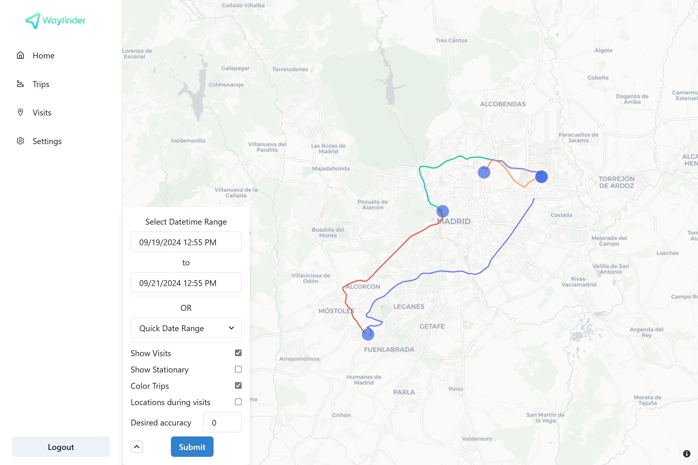
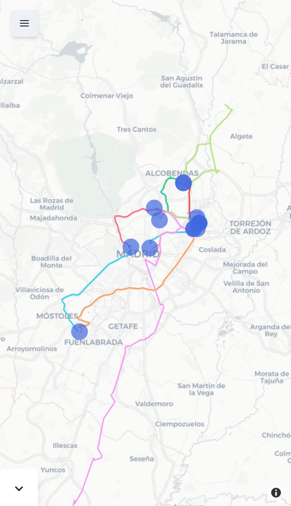

[](https://opensource.org/licenses/MIT)
[](https://img.shields.io/github/v/release/dontic/wayfinder)

Wayfinder is a self-hosted web app for [Overland-iOS](https://github.com/aaronpk/Overland-iOS).




---

Wayfinder has 3 main components:

1. A TimescaleDB database to store the location data received by Overland and other relevant data to make the App work
2. A django REST backend to process incoming and outgoing datta.
3. A desktop and mobile friendly React client to visualize the location data.

## Get Started

### Pre-requisites

You will need:

- Basic Docker knowledge
- A custom domain or dyndns service
- A reverse proxy (nginx, Traefic...)

### Docker compose and config file

#### 1. Just copy the `docker-compose.yml` and the `config.env` files in the root of this repository to a directory (you can also copy these files manually):

```bash
mkdir wayfinder && cd wayfinder
```

```bash
curl -O https://raw.githubusercontent.com/dontic/wayfinder/main/docker-compose.yml
```

```bash
curl -O https://raw.githubusercontent.com/dontic/wayfinder/main/config.env
```

#### 2. Modify the config file as needed:

```bash
nano config.env
```

##### 3. Spin the containers!

```bash
docker compose up -d
```

The web app should be accessible from `localhost:8080`

You can modify this port in the docker compose file under the `fronted` service.

### Configuration

By default you will log in with user and password `admin:admin`.

Then go to settings:

1. Copy the Overland token to your Overland app

2. Modify your username and password

## Contributing

Feel free to open issues, feature requests or pull requests to enhance Wayfinder!
