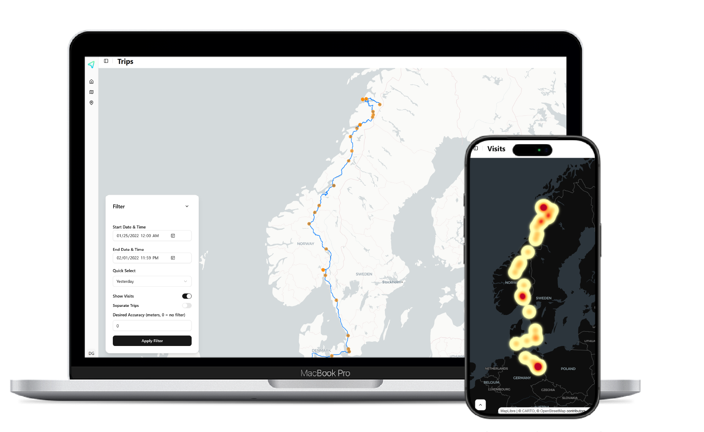

<p align="center">
  
</p>

<p align="center">
  <a href="https://opensource.org/licenses/MIT"></a>
  <a href="https://img.shields.io/github/v/release/dontic/wayfinder"></a>
</p>

<p align="center">Wayfinder is a self-hosted web app for <a href="https://github.com/aaronpk/Overland-iOS">Overland-iOS</a>.</p>

<p align="center">
  
</p>

---

Wayfinder is made up of the following services:

| Service | Description |
|---|---|
| **TimescaleDB** | Primary database for storing location data |
| **Redis** | Cache backend and Celery message broker |
| **Django** | REST API server |
| **Celery Worker** | Processes background tasks |
| **Celery Beat** | Schedules periodic tasks |
| **Frontend** | Desktop and mobile friendly React client |
| **Nginx** | Reverse proxy — routes `/` to the frontend and `/api/` to Django |

## Getting Started

> ℹ️ Pre-requisites:
> - Docker and Docker Compose installed
> - A domain or dynamic DNS service (for external access)
> - A tunnel or external reverse proxy pointing to port `8080` (e.g. Cloudflare Tunnel, nginx, Caddy)

1. Create a directory and download the `docker-compose.yml`:

    ```bash
    mkdir wayfinder && cd wayfinder
    ```

    ```bash
    curl -O https://raw.githubusercontent.com/dontic/wayfinder/main/docker-compose.yml
    ```

2. Edit the environment variables at the top of `docker-compose.yml`:

    ```bash
    nano docker-compose.yml
    ```

    At minimum, set these two values in the `x-environment` block:

    | Variable | Description |
    |---|---|
    | `SECRET_KEY` | A long, random secret string for Django.  |
    | `BASE_URL` | The public URL where Wayfinder will be accessible (e.g. `https://wayfinder.mydomain.com`) |

3. Run it!

    ```bash
    docker compose up -d
    ```

4. Access the app at `http://localhost:8080`

    > To change the port, update the `nginx` service ports in `docker-compose.yml`.

### Configuration

By default you will log in with username and password `admin` / `admin`.

Then go to your user (bottom left) → **Settings**:

1. Copy the **Overland token** (you can regenerate it at any time)
2. Paste the token into the Overland app's token field
3. Set the Overland server URL to `<BASE_URL>/api/wayfinder/overland/`
4. Update your username and password if needed

### Overland Settings for Wayfinder

These are the settings that work best with Wayfinder:

> Note: only Wayfinder-relevant settings are listed. All others are up to you.

- **Tracking Enabled**: `On`
- **Continuous Tracking Mode**: `Both`
- **Visit Tracking**: `On` — required to log visits in Wayfinder
- **Logging Mode**: `All Data`
- **Locations per Batch**: Depends on your server. Larger servers can handle bigger batches. _For low-powered hardware like a Raspberry Pi, keep this at 50–100._

## Updating Wayfinder

> ⚠️ **Always read the release notes before updating!**
>
> Breaking changes are occasionally introduced that require manual steps, which will be documented in the release notes.

```bash
docker compose pull && docker compose up -d
```

## Contributing

Feel free to open issues, feature requests, or pull requests to improve Wayfinder!

### Local Development

With either VSCode or Cursor:

1. Open the `/backend` and `/frontend` directories in separate windows
2. Make sure you have the **Dev Containers** extension installed
3. In each window: `F1` → `Dev Containers: Reopen in Container`
4. See the `README.md` in each directory for setup and startup instructions
