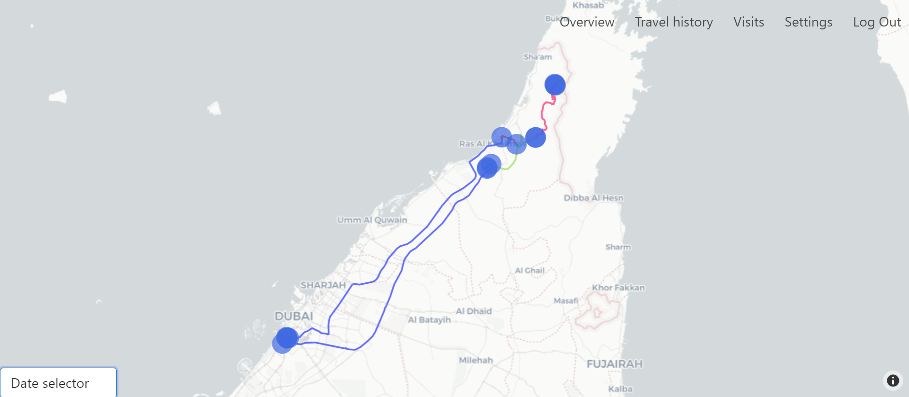

# wayfinder

## What is wayfinder?
Wayfinder is a Flask application that reads, process, stores and displays data gathered by the overland-ios app.

Wayfinder is built in Python with it's main libraries being Flask for the App (API and data display) and Pandas for data processing.

   

   

## Usage

For example purposes it's going to be assumed that the server is going to be set up on a debian environment like Raspbian.

You will also need to have ```python3``` installed.

> :information_source: [Click here]() for a tutorial on how to set up Raspbian on your Raspberry Pi.

### 1 Clone the repository

In this example de installation directory is going to be the home directory of the user.

```bash
cd /home/user
```
```bash
git clone https://github.com/dontic/wayfinder
```

The folder ```wayfinder``` will be created in that directory with all the necessary code.

```bash
cd wayfinder
```

#### 1.1 Create virtual environment

Ensure that python3 is installed in your system.

While in the wayfinder directory run:

```bash
python3 -m venv venv
```

Activate the virtual environment:

```bash
source venv/bin/activate
```

Install all the necessary requirements:

```bash
pip install -r requirements.txt
```

#### 1.2 Create user database

You will need to create a users.db database to store the users' credentials for the app.

The app is set up to create this automatically by running the following commands in a terminal:

```bash
from app import create_app
from app.extensions import db
from app.auth.models import *

db.create_all(app=create_app())
```

#### 1.3 Create location database directory

You will also need to create the `database` directory. This is where the location databases will be stored.

```bash
mkdir database
```

It's good practice to periodically back-up this `database` directory somewhere safe. Otherwise, if something goes wrong, you risk loosing all the data.

### 2. Initialize the app

There are several ways you can do this:

#### 2.1 The easiest way

Just run the app directly on your server:

```bash
python3 run.py
```

This will initiallize the app in your server on port 5012 by default. You can modify this port in `run.py`

>:warning: Note that if the server goes down or something crashes, you will need to manually restart the app each time.

#### 2.2 The resilent way

`supervisor` is a great way to run and monitor your app in the background so you can user your server for more things.

There are also other methods, like `cron`.

A really good supervisor guide [here](https://www.digitalocean.com/community/tutorials/how-to-install-and-manage-supervisor-on-ubuntu-and-debian-vps).

### 3 Sign up process

Just open any browser and go to the app address:

```
yourServerAdress:5012
```

You will see a Log In and Sign Up tabs at the top.

You can use the Sign Up tab to create your user and API Key.

You can modify your user details in the `settings` tab once you are logged in.

#### 3.1 Enabling and disabling signups

Go to the repo in your server and edit the ```config.py```:

```bash
cd /home/user/wayfinder
nano config.py
# Modify
# ENABLE_SIGNUPS = True
# to ENABLE_SIGNUPS = False
```

### 4 Overland App setup

In the Overland App on your phone, go to settings and setup the Receiver Endpoint to point to your server's API:

```
http://yourPublicIP:port/api/?username=<your_username>&apikey=<your_api_key>
```

Replace ```<your_username>``` and ```<your_api_key>``` with the user and API Key you have signed up with.

> :information_source: Check the [Overland Repo]() for detailed information on how to set up the Overland App in your phone.