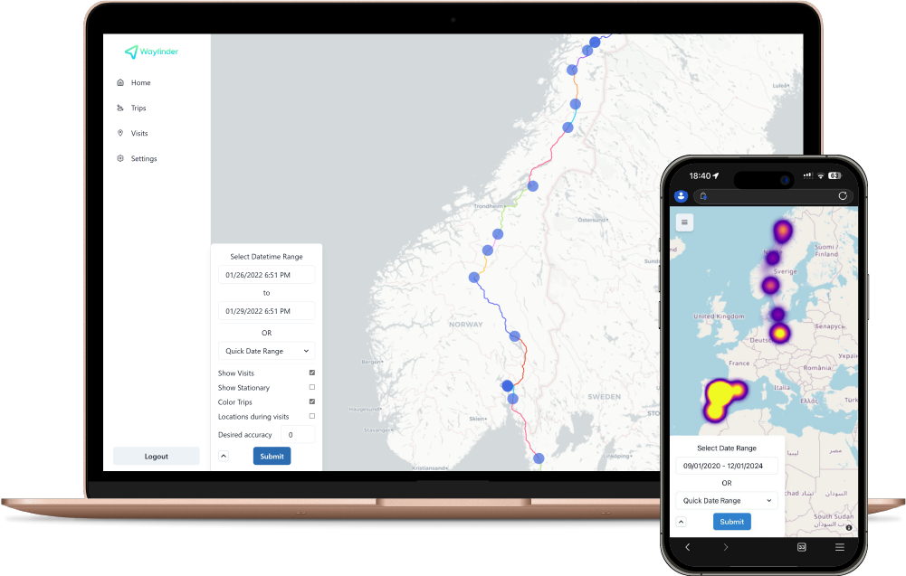

[](https://opensource.org/licenses/MIT)
[](https://img.shields.io/github/v/release/dontic/wayfinder)

Wayfinder is a self-hosted web app for [Overland-iOS](https://github.com/aaronpk/Overland-iOS).

<p align="center">
  
</p>

---

Wayfinder has 3 main components:

1. A **TimescaleDB** database to store the location data received by Overland and other relevant data to make the App work
2. A **django REST backend** to process incoming and outgoing datta.
3. A desktop and mobile friendly **React client** to visualize the location data.

## Get Started

### Pre-requisites

You will need:

- Basic Docker knowledge
- A custom domain or dyndns service
- A reverse proxy or tunnel (nginx, cloudflared...)

### Docker compose and config file

#### 1. Just copy the `docker-compose.yml` file in the root of this repository to a directory:

```bash
mkdir wayfinder && cd wayfinder
```

```bash
curl -O https://raw.githubusercontent.com/dontic/wayfinder/main/docker-compose.yml
```


#### 2. Modify the environment variables of the backend service as needed:

```bash
nano docker-compose.yml
```

##### 3. Run it!

```bash
docker compose up -d
```

The web app should be accessible from `localhost:8080`

You can modify this port in `docker-compose.yml` under the `fronted` service.

### Configuration

By default you will log in with user and password `admin:admin`.

Then go to your user (bottom left) -> **settings**:

1. Copy the Overland token (you can regenerate it when needed)

2. Paste the Token 'as is' into the Overland App token field

3. Modify the Overland server url to `<BASE_URL>/api/wayfinder/overland/`

4. Back in Wayfinder settings modify your username and password if needed

### Overland settings

These are the settings that work best with Wayfinder:

> Note that only Wayfinder relevant settings are included. The rest are left to your choosing.

- **Tracking Enabled**: `On`
- **Continuous Tracking Mode**: `Both`
- **Visit Tracking**: `On` -> Necessary to log visits in Wayfinder
- **Loggin Mode**: `All Data`
- **Locations per Batch**: Depends on where you host Wayfinder. Bigger servers will handle bigger batches easier. _I.e.: If you host on a raspberri pi keep it low to 50 or 100 per batch._

## Contributing

Feel free to open issues, feature requests or pull requests to enhance Wayfinder!

### How to develop locally

With either VSCode or Cursor:

1. Open the `/backend` and `/frontend` directories in separate windows

2. Make sure you have the dev containers extension installed

3. In each window: `F1` -> `Dev Containers: Reopen in container`

4. Read the `README.md` on both the frontend and the backend to see how to configure and start them.
